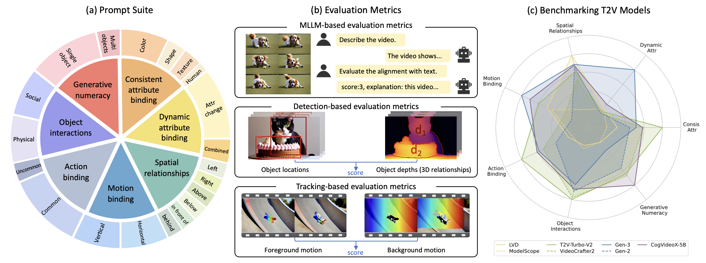
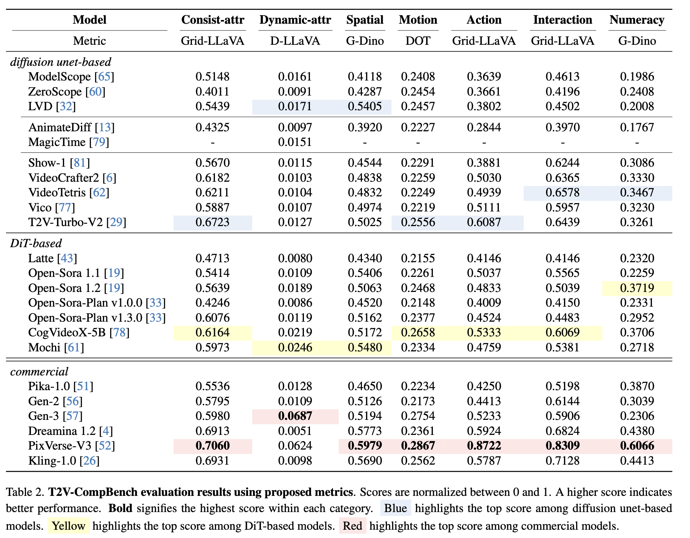

# T2V-CompBench: A Comprehensive Benchmark for Compositional Text-to-video Generation

<a href='https://t2v-compbench-2025.github.io/'></a>
<a href='https://arxiv.org/abs/2407.14505'></a> 
<a href='https://huggingface.co/spaces/Kaiyue/T2V-CompBench_Leaderboard'></a> 
[](https://huggingface.co/datasets/Kaiyue/T2V-CompBench-Videos)
[](https://www.youtube.com/watch?v=td0wWN-5PbY)


This repository is the official implementation of the following paper:
> **T2V-CompBench: A Comprehensive Benchmark for Compositional Text-to-video Generation**<br>
> [Kaiyue Sun](https://scholar.google.com/citations?user=mieuBzUAAAAJ&hl=en)<sup>1</sup>, [Kaiyi Huang](https://github.com/Karine-Huang)<sup>1</sup>, [Xian Liu](https://alvinliu0.github.io/)<sup>2</sup>, [Yue Wu](https://yuewuhkust.github.io/)<sup>3</sup>, Zihan Xu<sup>1</sup>, [Zhenguo Li](https://scholar.google.com/citations?hl=en&user=XboZC1AAAAAJ&view_op=list_works&sortby=pubdate)<sup>3</sup>, [Xihui Liu](https://xh-liu.github.io/)<sup>1</sup><br>
> ***<sup>1</sup>The University of Hong Kong, <sup>2</sup>The Chinese University of Hong Kong, <sup>3</sup>Huawei Noah’s Ark Lab***<br>
> IEEE/CVF Conference on Computer Vision and Pattern Recognition (CVPR), 2025

### Table of Contents
- [Updates](#updates)
- [Overview](#overview)
- [Evaluation Results](#evaluation_results)
- [Leaderboard](#leaderboard)
- [Prompt Suite](#prompt_suite)
- [Installation](#installation)
- [Prepare Evaluation Videos](#prepare_videos)
- [MLLM-based Evaluation](#mllm_eval)
  - [Consistent Attribute Binding](#consistent_attribute_binding)
  - [Dynamic Attribute Binding](#dynamic_attribute_binding)
  - [Action Binding](#action_binding)
  - [Object Interactions](#object_interactions)
- [Detection-based Evaluation](#detection_eval)
  - [Spatial Relationships](#spatial_relationships)
  - [Generative Numeracy](#generative_numeracy)
- [Tracking-based Evaluation](#tracking_eval)
  - [Motion Binding](#motion_binding)
- [Citation](#citation)

<a name="updates"></a>
## 🚩 Updates
- ✅ [10/2025] Release the generated videos for T2V-CompBench evaluation.
- :boom: [02/2025] Paper accepted to CVPR 2025.
- ✅ [01/2025] T2V-CompBench Leaderboard
- ✅ [01/2025] Release the evaluation scripts for the 7 categories.
- ✅ [01/2025] Release the prompt dataset and metadata.
  
<a name="overview"></a>
## :mega: Overview

We propose **T2V-CompBench**, the first benchmark tailored for **compositional text-to-video generation**. T2V-CompBench encompasses diverse aspects of compositionality, including **consistent attribute binding**, **dynamic attribute binding**, **spatial relationships**, **motion binding**, **action binding**, **object interactions**, and **generative numeracy**. We further carefully design evaluation metrics of **MLLM-based metrics**, **detection-based metrics**, and **tracking-based metrics**, which can better reflect the compositional text-to-video generation quality of seven proposed categories with 1400 text prompts. The effectiveness of the proposed metrics is verified by correlation with human evaluations. We also **benchmark various text-to-video generative models** and conduct in-depth analysis across different models and different compositional categories. We find that compositional text-to-video generation is highly challenging for current models, and we hope that our attempt will shed light on future research in this direction.

<a name="evaluation_results"></a>
## :mortar_board: Evaluation Results
We benchmark 17 publicly available text-to-video generation models and 6 commercial models including Kling, Gen-3, Gen-2, Pika, Dreamina and PixVerse. We normalize the results for clearer comparisons. 
Please see our leaderboard for the most updated ranking and numerical results. <a href='https://huggingface.co/spaces/Kaiyue/T2V-CompBench_Leaderboard'></a> 


<a name="leaderboard"></a>
## :mortar_board: How to join T2V-CompBench Leaderboard
If you have already evaluated all or any categories of T2V-CompBench in your report/paper, submit your eval_results.zip to the [T2V-CompBench Leaderboard](https://huggingface.co/spaces/Kaiyue/T2V-CompBench_Leaderboard) using the Submit here! form. The evaluation results will be automatically updated to the leaderboard. Also, share your model information for our records for any field in the form.

### Instructions:
The `.zip` file requires at most eight csv files if you have evaluated all the seven categories, please follow the evaluation steps to generate each of them, they are:
```
mymodel_consistent_attr_score.csv,
mymodel_dynamic_attr_score.csv,
mymodel_spatial_score.csv,
mymodel_motion_score.csv,
mymodel_motion_back_fore.csv,
mymodel_action_binding_score.csv,
mymodel_object_interactions_score.csv,
mymodel_numeracy_video.csv,
```

1. All of the files listed above are final CSV files that record the model's score for their respective categories, except for "mymodel_motion_back_fore.csv," which contains the intermediate results for motion binding.
Please replace "mymodel" with your model name.
2. If your model is unable to generate one or more videos for certain categories due to safety reasons or other technical issues, the evaluation scripts will automatically skip these cases. As a result, they will not be recorded in the CSV file, and the final average score will exclude them.
3. The backend script of our leaderboard will also exclude those ungenerated videos if any of the submitted final CSV files contain fewer than 200 videos.
4. To successfully showcase your model's performance on our leaderboard, please ensure that the last line of each final CSV file, which records the video-level scores, includes the model's score for that category. This line must begin with "score: " or "Score: ".

Put the CSV files in a folder and compress it, then submit the `.zip` to [T2V-CompBench Leaderboard](https://huggingface.co/spaces/Kaiyue/T2V-CompBench_Leaderboard)

<a name="prompt_suite"></a>
## :blue_book: T2V-CompBench Prompt Suite
The T2V-CompBench prompt suite includes 1400 prompts covering 7 categories, each with 200 prompts. 

For each category, the text prompts used to generate the videos are saved in a text file under the ```prompts/``` directory.
The meta data used to assist the evaluation are saved in a json file under the ```meta_data/``` directory.

<a name="installation"></a>
## :hammer: Installation

MLLM-based evaluation metrics are based on the official repository of [LLaVA](https://github.com/KaiyueSun98/T2V-CompBench/tree/V2/LLaVA). 
If you are evaluating **consistent attribute bindig, dynamic attribute binding, action binding and object interactions** with MLLM-based metrics, set the environment variable manually as follows:
```
conda create -n llava python==3.10.15
conda activate llava
cd LLaVA
pip install --upgrade pip # enable PEP 660 support 
pip install -e .
pip install -e ".[train]"
pip install flash-attn --no-build-isolation --no-cache-dir
```

Detection-based Evaluation metrics are based on the official repositories of [Depth Anything](https://github.com/KaiyueSun98/T2V-CompBench/tree/V2/Depth-Anything) and [GroundingSAM](https://github.com/KaiyueSun98/T2V-CompBench/tree/V2/Grounded-Segment-Anything). 
Tracking-based Evaluation metric is based on the repositories of [GroundingSAM](https://github.com/KaiyueSun98/T2V-CompBench/tree/V2/Grounded-Segment-Anything) and [Dense Optical Tracking](https://github.com/KaiyueSun98/T2V-CompBench/tree/V2/dot). 
If you are evaluating **spatial relationships, generative numeracy** with Detection-based metrics, or  **motion binding** with Tracking-based metrics:
1. Set the environment variable manually as follows:
```
export AM_I_DOCKER=False
export BUILD_WITH_CUDA=True
export CUDA_HOME=/path/to/cuda/
conda create -n compbench python==3.12.3
conda activate compbench
cd Grounded-Segment-Anything
python -m pip install -e segment_anything
pip install -r requirements.txt
cd ..
```
2. Download GroundingDINO checkpoints
```
mkdir Grounded-Segment-Anything/GroundingDINO/weights
cd Grounded-Segment-Anything/GroundingDINO/weights
wget -q https://github.com/IDEA-Research/GroundingDINO/releases/download/v0.1.0-alpha/groundingdino_swint_ogc.pth
cd ../../..
```
3. Download SAM weights
```
cd Grounded-Segment-Anything
# download the pretrained groundingdino-swin-tiny model
wget https://github.com/IDEA-Research/GroundingDINO/releases/download/v0.1.0-alpha/groundingdino_swint_ogc.pth
cd ..
```

4. Download DOT checkpoints
```
cd dot
wget -P checkpoints https://huggingface.co/16lemoing/dot/resolve/main/cvo_raft_patch_8.pth
wget -P checkpoints https://huggingface.co/16lemoing/dot/resolve/main/movi_f_raft_patch_4_alpha.pth
wget -P checkpoints https://huggingface.co/16lemoing/dot/resolve/main/movi_f_cotracker_patch_4_wind_8.pth
wget -P checkpoints https://huggingface.co/16lemoing/dot/resolve/main/movi_f_cotracker2_patch_4_wind_8.pth
wget -O checkpoints/movi_f_cotracker3_wind_60.pth https://huggingface.co/facebook/cotracker3/resolve/main/scaled_offline.pth
wget -P checkpoints https://huggingface.co/16lemoing/dot/resolve/main/panning_movi_e_tapir.pth
wget -P checkpoints https://huggingface.co/16lemoing/dot/resolve/main/panning_movi_e_plus_bootstapir.pth
cd ..
```
<a name="prepare_videos"></a>
## :clapper: Prepare Evaluation Videos

Generate videos of your model using the T2V-CompBench prompts provided in the `prompts` directory. Organize them in the following structure for each category (using the *consistent attribute binding* category as an example):

```
../video/consistent_attr
├── 0001.mp4
├── 0002.mp4
├── 0003.mp4
├── 0004.mp4
...
└── 0200.mp4
```


<a name="mllm_eval"></a>
## :speech_balloon: MLLM-based Evaluation

### :running: Run the Evaluation Scripts

The following evaluation scripts have been placed in the `LLaVA/llava/eval` directory:

- `compbench_eval_consistent_attr.py`
- `compbench_eval_dynamic_attr.py`
- `compbench_eval_action_binding.py`
- `compbench_eval_interaction.py`

Prepare the video repository path (*e.g.*, "../video/consistent_attr") in the argument `--video-path`. 
Configure the folder to store the csv result files with the `--output-path` argument, configure the json file containing meta information with the `--read-prompt-file` argument. The evaluation codes will automatically convert the videos into the required formats (image grid or 16 frames) and then calculate the score.

<a name="consistent_attribute_binding"></a>
#### :tangerine: Consistent Attribute Binding

Input the video path and run the command:

```
python llava/eval/compbench_eval_consistent_attr.py \
  --video-path ../video/consistent_attr \
  --output-path ../csv_consistent_attr \
  --read-prompt-file ../meta_data/consistent_attribute_binding.json \
  --t2v-model mymodel
```

The conversations with the MLLM will be saved in a CSV file: `../csv_consistent_attr/mymodel_consistent_attr_score.csv`. The video name, prompt, and score for each text-video pair will be recorded in the columns named of "name","prompt", "Score". 

The final score of the model in this category (consistent attribute binding) will be printed in the last line of this CSV file.

<a name="dynamic_attribute_binding"></a>
#### :lemon: Dynamic Attribute Binding

Input the video path and run the command:

```
python llava/eval/compbench_eval_dynamic_attr.py \
  --video-path ../video/dynamic_attr \
  --output-path ../csv_dynamic_attr \
  --read-prompt-file ../meta_data/dynamic_attribute_binding.json \
  --t2v-model mymodel
```

The conversations with the MLLM will be saved in a CSV file: `../csv_dynamic_attr/mymodel_dynamic_attr_score.csv`. The video name, prompt, and score for each text-video pair will be recorded in the columns named of "name","prompt", "Score". 

The final score of the model in this category (dynamic attribute binding) will be printed in the last line of this CSV file.

<a name="action_binding"></a>
#### :whale: Action Binding

Input the video path and run the command:

```
python llava/eval/compbench_eval_action_binding.py \
  --video-path ../video/action_binding \
  --output-path ../csv_action_binding \
  --read-prompt-file ../meta_data/action_binding.json \
  --t2v-model mymodel
```

The conversations with the MLLM will be saved in a CSV file: `../csv_action_binding/mymodel_action_binding_score.csv`. The video name, prompt, and score for each text-video pair will be recorded in the columns named of "name","prompt", "Score". 

The final score of the model in this category (action binding) will be printed in the last line of this CSV file.

<a name="object_interactions"></a>
#### :crystal_ball: Object Interactions

Input the video path and run the command:

```
python llava/eval/compbench_eval_interaction.py \
  --video-path ../video/interaction \
  --output-path ../csv_object_interactions \
  --read-prompt-file ../meta_data/object_interactions.json \
  --t2v-model mymodel
```

The conversations with the MLLM will be saved in a CSV file: `../csv_object_interactions/mymodel_object_interactions_score.csv`. The video name, prompt, and score for each text-video pair will be recorded in the columns named of "name","prompt", "Score". 

The final score of the model in this category (object interactions) will be printed in the last line of this CSV file.

<a name="detection_eval"></a>
## :mag_right: Detection-based Evaluation
We use **GroundingDINO** as the detection tool to evaluate the two categories: 2D spatial relationships and generative numeracy.

We use **Depth Anything + GroundingSAM** to evaluate 3D spatial relationships ("in front of" & "behind").

### :running: Run the Evaluation Scripts

The following script used to obtain the segmentations for 3D-spatial relationship evaluation has been placed in the `Depth-Anything/` directory:

- `compbench_run_depth.py`

The following evaluation script for all spatial relationships has been placed in the `Grounded-Segment-Anything/` directory:

- `comopbench_eval_spatial_relationships.py`

The following evaluation script for numeracy has been placed in the `Grounded-Segment-Anything/GroundingDINO/demo` directory:

- `compbench_eval_numeracy.py`

<a name="spatial_relationships"></a>
#### :cactus: Spatial Relationships

Input the video path and run the command:

```
python Grounded-Segment-Anything/compbench_eval_spatial_relationships.py \
  --video-path video/spatial_relationships \
  --depth_folder output_spatial_depth \
  --output-path csv_spatial \
  --read-prompt-file meta_data/spatial_relationships.json \
  --t2v-model mymodel \
  --output_dir output_spatial
```

This script will firstly convert the videos into frames, which will be stored in the default directory: `video/frames/spatial_relationships/`, then it will obtain the depth images for 3D-spatial relationship evaluation and place them under the `../output_spatial_depth/mymodel` directory.
Having these all prepared, it will start the evaluation.

The output frame images showing the object bounding boxes for 2D spatial relationships and those showing the object bounding boxes toghther with segmentations for 3D spatial relationships will be stored in the `output_spatial/mymodel` directory.

The frame scores will be saved in `csv_spatial/mymodel_2dframe.csv` and `csv_spatial/mymodel_3dframe.csv`.

Frame scores will be combined to calculate the video scores, which will be saved in `csv_spatial/mymodel_2dvideo.csv` and `csv_spatial/mymodel_3dvideo.csv`.

The score for each video of this category (spatial relationships), and the final result of the model will be saved in `csv_spatial/mymodel_spatial_score.csv`.


<a name="generative_numeracy"></a>
#### :apple: Generative Numeracy
Input the video path and run the command:

```
python Grounded-Segment-Anything/GroundingDINO/demo/compbench_eval_numeracy.py \
  --video-path video/generative_numeracy \
  --output-path csv_numeracy \
  --read-prompt-file meta_data/generative_numeracy.json \
  --t2v-model mymodel \
  --output_dir output_numeracy 

```
The output frame images showing the object bounding boxes will be stored in the `output_numeracy/mymodel` directory.

The frame scores will be saved in `csv_numeracy/mymodel_numeracy_frame.csv`.

They will be combined to calculate the video scores, which will be saved in `csv_numeracy/mymodel_numeracy_video.csv`.

The final score of the model in this category (generative numeracy) will be printed in the last line of this CSV file.

<a name="tracking_eval"></a>
## :tractor: Tracking-based Evaluation
We use **GroundingSAM + DOT** to evaluate motion binding.

### :running: Run the Evaluation Scripts

The following script used to obtain the segmentations of foreground objects has been placed in the `Grounded-Segment-Anything/` directory:

- `compbench_motion_binding_seg.py`

The following evaluation script for motion binding has been placed in the `dot/` directory:

- `compbench_eavl_motion_binding.py`

The config file for the evaluation script has been placed in the `dot/dot/utils/options/` directory:
- `compbench_demo_options.py`

<a name="motion_binding"></a>
#### :white_circle: Motion Binding

##### step 1: prepare the input images

Configure the total number of video frames with the `--total_frame` argument, the video fps (frames per second) with the `--fps` argument. The script will convert the videos into the required formats.

```
python Grounded-Segment-Anything/compbench_motion_binding_seg.py \
  --video-path video/motion_binding \
  --read-prompt-file meta_data/motion_binding.json \
  --t2v-model mymodel \
  --total_frame 16 \
  --fps 8 \
  --output_dir output_motion_binding_seg
```

The downsampled video with fps≈8 will be stored in the default directory: `video/video_standard/motion_binding/`

The background and forground segmentations of the 1st frame for videos in this category will be stored in the `output_motion_binding_seg/mymodel` directory.

##### step 2: Track the foregroud and background points

```
cd dot
python compbench_eval_motion_binding.py \
  --video-path ../video/video_standard/motion_binding \
  --mask_folder ../output_motion_binding_seg \
  --read-prompt-file ../meta_data/motion_binding.json \
  --t2v_model mymodel \
  --output_path ../csv_motion_binding \
  --output_dir ../output_motion_binding
```

The output videos showing the foreground and background point tracking will be stored in the `../output_motion_binding/mymodel` directory.

The average movement of foreground points will be saved in `../csv_motion_binding/mymodel_foreground.csv`.

The average movement of background points will be saved in `../csv_motion_binding/mymodel_background.csv`.

They are combined to calculate the motion vector of the foreground object(s), which will be saved in `../csv_motion_binding/mymodel_motion_back_fore.csv`.

The score for each video will be saved in `../csv_motion_binding/mymodel_motion_score.csv`

The final score of the model for this category (motion) will be printed in the last line of `../csv_motion_binding/mymodel_score.csv`.


<a name="citation"></a>
## :black_nib: Citation
If you find T2V-CompBench useful for your research, please cite our paper. :)
```
@article{sun2024t2v,
  title={T2V-CompBench: A Comprehensive Benchmark for Compositional Text-to-video Generation},
  author={Sun, Kaiyue and Huang, Kaiyi and Liu, Xian and Wu, Yue and Xu, Zihan and Li, Zhenguo and Liu, Xihui},
  journal={arXiv preprint arXiv:2407.14505},
  year={2024}
}
```
